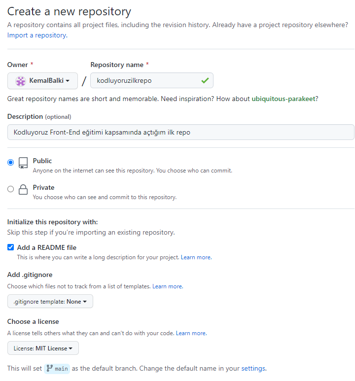

# Kodluyoruz Ilk Repo
Bu repo [Kodluyoruz](https://www.kodluyoruz.org/) Front-End Eğitiminde oluşturduğumuz ilk repo. İçerisinde bir adet README dosyası, bir adet index.html barındırıyor.



## Installation

Öncelikle projeyi clonelayın.(Buraya sizin reponuzdan aldığınız link gelecek)

```
git clone https://githup.com/kemalbalki/kodluyoruzilkrepo.git
```

## Usage
 
Projeyi cloneladıktan sonra Visual Code programında açınız.

Linux için:

```
cd kodluyoruzilkrepo
code
```

## Contributing
Pull requsetler kabul edilebilir.Büyük değişiklikler için, lütfen önce neyi değiştirmek istediğinizi tartışmak için bir konu açınız.

 ## Licence

[MIT](https://choosealicense.com/licenses/mit/)

